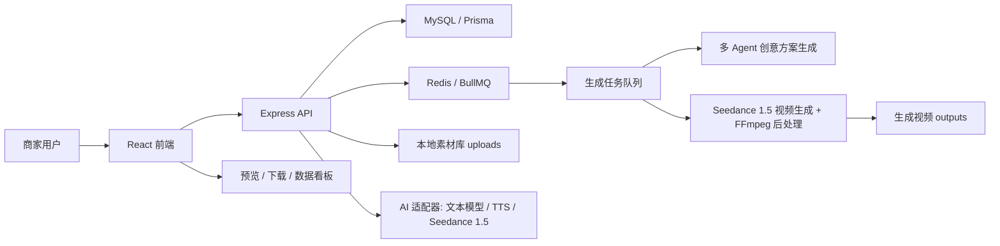

# 电商场景 AIGC 带货视频生成系统：两周 MVP 实现文档

> 适用对象：3 人新手团队  
> 目标：两周内做出可演示、可运行、可解释的端到端 Demo  
> 策略：先保证 P0 全链路跑通，再补 2-3 个高性价比亮点

---

## 0. 给队友看的说明

这份文档不是完整商业系统设计，而是根据比赛 Word 赛题压缩出来的两周可执行 MVP 方案。赛题原本覆盖素材管理、剧本生成、智能剪辑、分镜干预、数据回流、Agent 编排、CI/CD、可观测性等很多能力；如果全部都做，三位新手两周内风险很高。

我们的策略是：

- 必须做完 P0：素材上传、创意方案生成、基础分镜、用户审核确认、Seedance 1.5 视频生成、任务进度、预览导出。
- 选择性做 P1：分镜级编辑、TTS/字幕/BGM、生成过程 Trace、Mock 数据看板。
- P2 只做展示型亮点：A/B 对比、Prompt 模板、合规检查三选一即可。
- 第 7 天必须跑通一次完整链路，哪怕视频还很粗糙。
- 第 10 天以后不再大改架构，只修 bug、补文档、录演示视频。

一句话判断项目是否成功：

> 评委能在 3 分钟内看懂：商家上传素材和卖点，系统生成分镜剧本，用户可以微调，最后得到一条 15 秒以内的带货视频，并能看到任务过程和基础转化分析。

### 0.1 赛题要求与本方案对应关系

| Word 赛题要求 | 本方案如何落地 | 优先级 |
| --- | --- | --- |
| 商品素材上传 | 图片/视频上传到本地 `uploads`，前端素材库预览 | P0 |
| 素材结构化 | 手动标签 + AI 描述，后续可扩展 Embedding | P0/P1 |
| 素材检索 | 第一版做关键词/标签筛选，向量检索作为加分 | P1 |
| 创意方案生成 | 多 Agent 根据商品和广告诉求输出 CreativePlan，后续驱动 Seedance 1.5 视频生成 | P0 |
| Prompt 调整 | 用户可修改卖点、风格、目标人群后重新生成 | P0 |
| 分镜干预 | 分镜卡片可改字幕、旁白、时长、素材 | P1 |
| 生成前审核 | 提示词、广告词、分镜、台词、合规结果先给用户确认 | P0 |
| 视频生成 | 用户确认后调用 Seedance 1.5，FFmpeg 做字幕/BGM/转码 | P0 |
| 视频不超过 15 秒 | 后端校验分镜总时长，默认 3-5 个分镜 | P0 |
| 任务进度 | 任务表记录 pending/running/success/failed 和日志 | P0 |
| 预览导出 | 前端 `video` 预览，提供下载链接 | P0 |
| TTS/字幕/BGM | 字幕和 BGM 必做，TTS 尽量做 | P1 |
| 数据回流反哺 | 用 Mock 播放、点击、转化数据做看板 | P1 |
| Agent 编排 | 不做重框架，用 AI Provider + Trace 表达编排思路 | P2 |
| CI/CD/可观测性 | README 说明，能做 GitHub Actions 更好 | P2 |
| 提交材料 | README、架构图、演示视频、生成样例、团队分工 | 必交 |

### 0.2 我们明确不做什么

为了保证两周内能交付，以下内容不要作为第一版目标：

- 不做真实 TikTok Shop 后台数据接入。
- 不做复杂专业时间轴剪辑器。
- 不做完整多租户商家系统。
- 不做真实爆款视频爬虫和版权复制。
- 视频主模型按活动生态使用 Seedance 1.5，但必须保留 Mock/FFmpeg 兜底，避免 API、审核、排队时间影响演示。
- 后端使用 Node.js + TypeScript；数据层推荐 MySQL + Redis，MySQL 存业务数据，Redis 做生成队列和实时进度。
- 不把对象存储、K8s、复杂 Agent 框架作为必需项。

这些能力可以写在“未来规划”或“可扩展设计”里，但不要让它们拖垮 MVP。

---

## 1. 项目定位

### 1.1 一句话说明

面向中小商家的 AIGC 带货视频生成工具：商家上传商品素材，填写商品卖点和广告诉求，系统先生成可审核的广告词、剧本、分镜、台词和 Seedance 1.5 提示词；商家确认后，再生成一条 15 秒以内的带货视频。

### 1.2 两周 MVP 目标

我们不追求真实生产级视频效果，而是追求评委能快速看懂：

- 用户路径完整：上传素材 -> 生成创意方案 -> 审核提示词/广告词/分镜 -> 确认生成 -> 预览导出。
- 工程结构清楚：前端、后端、MySQL、Redis 队列、素材库、创意方案服务、Seedance 1.5 视频服务都有边界。
- AI 使用合理：多 Agent 流水线负责编排广告策略、剧本、分镜、台词、Seedance 提示词和内容审查；Seedance 1.5 负责核心视频生成，FFmpeg 负责兜底合成与字幕/BGM 后处理。
- 有电商业务意识：每条视频围绕卖点、目标人群、场景、CTA 转化设计。

### 1.3 推荐项目名

`ClipShop AI` 或 `AIVideoSeller`

提交材料中可以写：

> ClipShop AI 是一个面向 TikTok Shop 商家的 AIGC 带货视频生成系统，帮助商家从商品素材和广告诉求出发，先生成可审核的创意方案，再调用 Seedance 1.5 生成短视频成片，降低电商短视频生产门槛。

---

## 2. 功能优先级

### 2.1 P0 必做范围

| 模块 | 功能 | MVP 做法 | 验收标准 |
| --- | --- | --- | --- |
| 素材模块 | 商品素材上传 | 上传图片、短视频，保存到本地或对象存储 | 能在素材库列表看到预览、名称、类型 |
| 素材模块 | 素材结构化 | 手动标签 + 简单 AI 描述 | 每个素材有标签、描述、所属商品 |
| 创意方案模块 | 创意方案生成 | 多 Agent 根据商品信息、素材、广告词生成广告策略、剧本和 3-5 个分镜 | 返回可审核的 CreativePlan |
| 创意方案模块 | Prompt 调整 | 用户可修改风格、目标人群、卖点、Seedance 提示词 | 重新生成后内容变化明显 |
| 创作模块 | 确认生成视频 | 用户审核 CreativePlan 后再调用 Seedance 1.5 | 生成一条小于 15 秒 mp4 |
| 创作模块 | 任务进度 | 后端维护任务状态，前端轮询或 SSE | 能显示排队、生成中、完成、失败 |
| 创作模块 | 预览导出 | 前端 video 标签预览，提供下载按钮 | 成片可播放、可下载 |

### 2.2 P1 推荐加分范围

优先选这 4 个，性价比最高：

| 功能 | 原因 | 简化实现 |
| --- | --- | --- |
| 分镜级编辑 | 很贴合赛题，前端观感好 | 分镜卡片支持改字幕、时长、素材 |
| TTS 配音 | 成片效果提升明显 | 用浏览器语音、Edge TTS、火山 TTS 或可替代服务 |
| Mock 数据看板 | 展现电商转化思维 | 造播放、点击、转化率数据，用 ECharts 展示 |
| 生成过程 Trace | 展现工程能力 | 记录每一步耗时、输入、输出、失败原因 |
| 连贯性检查 | 解决多分镜不连贯 | Visual Bible + 商品外观/场景/风格一致性检查 |

### 2.3 P2 谨慎尝试

如果第 10 天前 P0 已经完成，再做：

- A/B 对比：同一商品生成两个版本，展示 Mock 转化表现。
- Prompt 模板市场：预置 6 个风格模板，如痛点型、测评型、场景种草型。
- 合规检查：检查是否包含绝对化宣传词，如“第一”“永久”“100%有效”。

---

## 3. 推荐技术栈

### 3.1 总体选择

| 层级 | 技术 | 选择原因 |
| --- | --- | --- |
| 前端 | React + TypeScript + Vite | 上手快，资料多 |
| UI | Ant Design | 表单、上传、步骤条、表格都现成 |
| 图表 | ECharts | 做数据看板省时间 |
| 后端 | Node.js + TypeScript + Express | 和前端同语言，团队学习成本低 |
| 数据库 | MySQL + Prisma | 结构化保存商品、素材、创意方案、分镜、任务、日志 |
| 队列/缓存 | Redis + BullMQ | 处理 Seedance 1.5 长任务队列、实时进度和失败重试 |
| 文件存储 | 本地 uploads 目录 | 两周内减少云服务复杂度 |
| 视频生成 | Seedance 1.5 | 活动生态主模型，负责生成分镜视频或整条视频 |
| AI 调用 | 火山引擎 Seedance 1.5 + 文本模型/模板适配器 | 贴合抖音/火山生态，其他模型只作为兜底 |
| 视频后处理 | FFmpeg | 字幕、BGM、格式转换、兜底合成 |
| 任务进度 | Redis + MySQL 任务表 | Redis 管实时状态，MySQL 留最终记录和 Trace |

### 3.2 为什么不用太重的架构

MySQL 和 Redis 可以使用，因为它们非常适合这个项目：MySQL 保存商品、素材、创意方案、分镜、任务和日志；Redis 负责长耗时视频生成队列和实时进度。不要一开始上 K8s、复杂 Agent 框架或对象存储。MVP 的重点是端到端链路、生成前审核、Seedance 1.5 接入和可解释的任务 Trace。

---

## 4. 系统架构



### 4.1 核心链路

1. 用户创建商品，填写标题、卖点、目标人群、使用场景。
2. 用户上传商品主图、细节图、参考视频。
3. 后端保存素材，并生成基础结构化信息：类型、标签、描述、时长、缩略图。
4. 用户选择视频风格模板，点击“生成创意方案”。
5. 多 Agent 流水线生成 CreativePlan：广告策略、Hook、广告词、CTA、Visual Bible、分镜、台词、Seedance 1.5 提示词、合规检查、连贯性检查。
6. 用户在方案审核页检查并修改广告词、分镜、字幕、素材、Seedance 提示词。
7. 用户点击“确认生成视频”，后端创建 GenerationTask，并推入 Redis/BullMQ 队列。
8. Worker 优先调用 Seedance 1.5 按分镜生成视频片段，失败时用上传素材 + FFmpeg 兜底。
9. FFmpeg 拼接片段，添加字幕、BGM、可选 TTS，输出 mp4。
10. 前端展示任务进度，完成后播放成片。
11. 数据看板展示 Mock 播放量、点击率、转化率，并给出优化建议。

---

## 5. 页面设计

### 5.1 页面列表

| 页面 | 路径 | 主要内容 |
| --- | --- | --- |
| 首页/工作台 | `/` | 项目列表、最近生成视频、快捷创建 |
| 创建商品 | `/products/new` | 商品标题、卖点、目标人群、场景 |
| 素材库 | `/products/:id/materials` | 上传、预览、标签、描述 |
| 创意方案生成 | `/products/:id/creative-plan` | 风格模板、广告诉求、生成方案按钮 |
| 方案审核/分镜编辑器 | `/creative-plans/:id/review` | 广告词、Visual Bible、合规提示、分镜列表、Seedance Prompt 编辑 |
| 生成进度 | `/tasks/:id` | 进度条、步骤日志、失败重试 |
| 视频预览 | `/videos/:id` | 播放器、下载、基础数据 |
| 数据看板 | `/analytics` | Mock 转化指标、A/B 对比、优化建议 |

### 5.2 分镜编辑器最小形态

不用做复杂专业剪辑软件，做成“左侧分镜卡片 + 右侧审核与编辑表单”即可。这个页面是项目核心，因为它体现“生成前可审核，不是黑盒生成”。

每个分镜卡片包含：

- 分镜编号。
- 素材缩略图。
- 时长，例如 3s。
- 字幕。
- 旁白。
- 画面描述。
- Seedance 1.5 提示词。
- 合规/连贯性警告。
- 操作按钮：上移、下移、替换素材、重新生成文案、删除。

---

## 6. 数据模型

### 6.1 Product 商品

```ts
type Product = {
  id: string;
  title: string;
  category: string;
  sellingPoints: string[];
  targetAudience: string;
  usageScene: string;
  createdAt: string;
};
```

### 6.2 Material 素材

```ts
type Material = {
  id: string;
  productId: string;
  type: "image" | "video";
  fileUrl: string;
  thumbnailUrl?: string;
  title: string;
  tags: string[];
  aiDescription?: string;
  duration?: number;
  createdAt: string;
};
```

### 6.3 CreativePlan 创意方案

```ts
type CreativePlan = {
  id: string;
  productId: string;
  status: "draft" | "approved" | "rendering" | "rendered" | "failed";
  style: "pain_point" | "review" | "scenario" | "discount" | "premium";
  title: string;
  hook: string;
  adCopy: string;
  cta: string;
  visualBible: VisualBible;
  scenes: Scene[];
  complianceWarnings: ComplianceWarning[];
  continuityWarnings: ContinuityWarning[];
  promptTrace: AgentTrace[];
  createdAt: string;
  updatedAt: string;
};
```

### 6.4 VisualBible 全局视觉设定

```ts
type VisualBible = {
  aspectRatio: "9:16" | "16:9";
  style: string;
  colorTone: string;
  lighting: string;
  cameraStyle: string;
  productAppearance: string;
  mainScenes: string[];
  character?: string;
  continuityRules: string[];
};
```

### 6.5 Scene 分镜

```ts
type Scene = {
  id: string;
  creativePlanId: string;
  order: number;
  duration: number;
  visualDescription: string;
  subtitle: string;
  voiceover: string;
  materialId?: string;
  seedancePrompt: string;
  continuityFromPrevious?: string;
  continuityToNext?: string;
  warnings: string[];
  transition: "cut" | "fade" | "zoom";
};
```

### 6.6 ComplianceWarning / AgentTrace

```ts
type ComplianceWarning = {
  level: "info" | "warn" | "error";
  field: "hook" | "adCopy" | "cta" | "subtitle" | "voiceover" | "seedancePrompt";
  message: string;
  suggestion?: string;
};

type ContinuityWarning = {
  level: "info" | "warn" | "error";
  sceneOrder?: number;
  message: string;
  suggestion?: string;
};

type AgentTrace = {
  agentName: string;
  inputSummary: string;
  outputSummary: string;
  durationMs: number;
  status: "success" | "failed";
};
```

### 6.7 GenerationTask 生成任务

```ts
type GenerationTask = {
  id: string;
  productId: string;
  creativePlanId: string;
  status: "pending" | "running" | "success" | "failed";
  progress: number;
  currentStep: string;
  logs: TaskLog[];
  outputVideoUrl?: string;
  provider: "seedance_1_5" | "ffmpeg_fallback";
  errorMessage?: string;
  createdAt: string;
  updatedAt: string;
};
```

---

## 7. 后端接口设计

### 7.1 商品接口

| 方法 | 路径 | 说明 |
| --- | --- | --- |
| `POST` | `/api/products` | 创建商品 |
| `GET` | `/api/products` | 获取商品列表 |
| `GET` | `/api/products/:id` | 获取商品详情 |
| `PUT` | `/api/products/:id` | 更新商品 |

### 7.2 素材接口

| 方法 | 路径 | 说明 |
| --- | --- | --- |
| `POST` | `/api/products/:id/materials` | 上传素材 |
| `GET` | `/api/products/:id/materials` | 获取素材列表 |
| `PUT` | `/api/materials/:id` | 更新标签/描述 |
| `DELETE` | `/api/materials/:id` | 删除素材 |

### 7.3 创意方案与分镜接口

| 方法 | 路径 | 说明 |
| --- | --- | --- |
| `POST` | `/api/products/:id/creative-plans/generate` | 生成创意方案，包括广告词、分镜、Seedance Prompt、审查结果 |
| `GET` | `/api/products/:id/creative-plans` | 获取创意方案列表 |
| `GET` | `/api/creative-plans/:id` | 获取创意方案详情 |
| `PUT` | `/api/creative-plans/:id` | 修改广告词、Hook、CTA、Visual Bible |
| `POST` | `/api/creative-plans/:id/approve` | 用户确认方案 |
| `PUT` | `/api/creative-plans/:id/scenes/:sceneId` | 修改分镜 |
| `POST` | `/api/creative-plans/:id/scenes/:sceneId/regenerate` | 单分镜重生成 |

### 7.4 视频任务接口

| 方法 | 路径 | 说明 |
| --- | --- | --- |
| `POST` | `/api/creative-plans/:id/render` | 用户确认后创建视频生成任务 |
| `GET` | `/api/tasks/:id` | 查询任务状态 |
| `GET` | `/api/tasks/:id/events` | SSE 推送任务进度，可选 |
| `POST` | `/api/tasks/:id/retry` | 失败重试 |

### 7.5 数据看板接口

| 方法 | 路径 | 说明 |
| --- | --- | --- |
| `GET` | `/api/analytics/overview` | 总览指标 |
| `GET` | `/api/analytics/videos/:id` | 单视频表现 |
| `GET` | `/api/analytics/ab-tests` | A/B Mock 对比 |

---

## 8. AI 与视频生成方案

### 8.1 AI 适配器接口

先不要把代码写死到某一个模型，后端定义统一接口：

```ts
interface AiProvider {
  generateCreativePlan(input: CreativePlanInput): Promise<CreativePlanDraft>;
  regenerateScene(input: SceneRegenerateInput): Promise<Scene>;
  generateMaterialDescription?(filePath: string): Promise<string>;
  generateTts?(text: string, options: TtsOptions): Promise<string>;
}
```

第一版建议实现三个 Provider/服务：

- `MockAiProvider`：没有 API Key 时返回固定样例，保证演示不崩。
- `CreativePlanProvider`：调用文本模型或模板生成结构化 CreativePlan JSON。
- `SeedanceVideoProvider`：调用 Seedance 1.5 生成分镜视频或整条视频，是本项目的视频主模型。

### 8.2 多 Agent 生成前审核链路

第一版不需要引入复杂 Agent 框架，可以用 Node.js/TypeScript service 顺序编排，保存每一步输入输出摘要作为 Trace。

```text
ProductAnalysisAgent
-> AdStrategyAgent
-> ScriptAgent
-> StoryboardAgent
-> SeedancePromptAgent
-> ComplianceAgent
-> ContinuityAgent
```

每个 Agent 的职责：

| Agent | 输入 | 输出 |
| --- | --- | --- |
| ProductAnalysisAgent | 商品信息、素材标签/描述 | 核心卖点、用户痛点、适合场景 |
| AdStrategyAgent | 商品理解结果、商户广告词、目标人群 | 广告策略、Hook、CTA、风格 |
| ScriptAgent | 广告策略 | 广告词、旁白、字幕草稿 |
| StoryboardAgent | 脚本草稿 | 3-5 个分镜，含时长、画面、字幕、旁白 |
| SeedancePromptAgent | 分镜、Visual Bible、素材 | 每个分镜的 Seedance 1.5 Prompt |
| ComplianceAgent | 广告词、台词、Prompt | 违规词、夸大宣传、缺少 CTA 等风险 |
| ContinuityAgent | Visual Bible、分镜、Prompt | 商品外观、人物、场景、色调连贯性检查 |

### 8.3 创意方案生成 Prompt 模板

```text
你是 TikTok Shop 电商短视频编导。
请根据商品信息、商户广告词和素材描述，生成一份视频生成前可供商家审核的创意方案。

商品标题：{{title}}
商品类目：{{category}}
核心卖点：{{sellingPoints}}
目标人群：{{targetAudience}}
使用场景：{{usageScene}}
商户广告词：{{merchantAdCopy}}
可用素材：{{materials}}
视频风格：{{style}}
约束：
1. 总时长不超过 15 秒。
2. 输出 3-5 个分镜。
3. 必须输出 Visual Bible，用于保证后续 Seedance 1.5 分镜生成连贯。
4. 每个分镜必须包含 duration、visualDescription、subtitle、voiceover、seedancePrompt、transition。
5. 文案必须适合电商转化，包含开场 Hook 和结尾 CTA。
6. 不要使用绝对化违规词。
7. 只输出 JSON，不要输出解释。
```

### 8.4 Seedance 1.5 + FFmpeg 生成策略

第一版视频生成应以 Seedance 1.5 为主，FFmpeg 作为稳定兜底和后处理工具。这样既贴合抖音/火山生态，也能避免模型排队、审核或 Key 不稳定导致 Demo 彻底不可用。

主路径：

1. AI 生成 CreativePlan JSON，包括广告词、Visual Bible、分镜和 Seedance Prompt。
2. 每个分镜整理出 Seedance 1.5 可用的生成输入：画面描述、商品素材、时长、风格、画幅。
3. 调用 Seedance 1.5 生成分镜视频片段，或根据活动 API 能力生成整条短视频。
4. 用 FFmpeg 做字幕、BGM、TTS 音轨、格式转换和最终导出。

兜底路径：

1. 图片素材：使用 `zoompan` 做轻微推拉效果。
2. 视频素材：按分镜时长裁切。
3. 字幕：生成 `.srt` 或使用 `drawtext`。
4. 配音：如果 TTS 不稳定，先允许静音 + 字幕；有 TTS 后混入音频。
5. BGM：准备 2-3 首可商用或自制短 BGM，按风格选择。
6. 输出：`mp4, h264, 720x1280, 9:16`。

---

## 9. 推荐目录结构

```text
aigc-video-system/
  apps/
    web/
      src/
        pages/
        components/
        services/
        stores/
    api/
      src/
        modules/
          products/
          materials/
          creative-plans/
          render/
          analytics/
        providers/
          ai/
          storage/
        jobs/
        prisma/
  packages/
    shared/
      src/
        types/
        schemas/
  uploads/
  outputs/
  docs/
    architecture.md
    api.md
    demo-script.md
  README.md
```

如果团队觉得 monorepo 太难，也可以简单拆成：

```text
frontend/
backend/
docs/
uploads/
outputs/
```

---

## 10. 三人分工

### 成员 A：前端与交互

负责：

- React 项目搭建。
- 商品创建页、素材上传页。
- 创意方案生成页、方案审核/分镜编辑器。
- 任务进度页、视频预览页。
- 数据看板页面。

每日交付：

- 至少一个可点击页面。
- 接口先用 Mock，后端 ready 后切真实 API。

### 成员 B：后端与数据

负责：

- Express + TypeScript 项目搭建。
- Prisma + MySQL 数据表。
- Redis + BullMQ 任务队列。
- 上传接口、商品接口、剧本接口。
- 任务状态、日志、失败重试。
- README 启动说明。

每日交付：

- Postman/Swagger 可测试接口。
- 数据库 migration 和种子数据。

### 成员 C：AI 与视频合成

负责：

- Prompt 模板设计。
- AI Provider 抽象和 Mock Provider。
- 多 Agent 创意方案流水线。
- Seedance 1.5 视频生成 Provider。
- FFmpeg 后处理和兜底合成脚本。
- TTS/字幕/BGM。
- Demo 商品素材和生成样例视频。

每日交付：

- 能独立跑通一个脚本。
- 每个阶段保存输入输出样例，方便答辩展示。

---

## 11. 两周排期

### 第 1 天：定方案 + 建项目

目标：

- 确定 MVP 范围，只做 P0 + 少量 P1。
- 建 Git 仓库。
- 前后端项目初始化。
- 整理 2 个 Demo 商品素材包。

产出：

- README 初版。
- 项目目录结构。
- 页面原型草图。
- MySQL 数据模型初版。
- Redis/BullMQ 队列方案初版。

### 第 2 天：商品与素材链路

目标：

- 前端完成商品创建表单。
- 后端完成商品 CRUD。
- 完成素材上传接口。
- 前端能展示上传后的图片/视频。

产出：

- 商品详情页。
- 素材库页面。
- 上传文件保存到 `uploads/`。

### 第 3 天：创意方案 Mock 链路

目标：

- 后端完成 `MockAiProvider`，能返回 CreativePlan。
- 前端完成“生成创意方案”按钮和方案审核页。
- CreativePlan 以 JSON + scenes 形式存库。

产出：

- 点击“生成创意方案”后出现广告词、Hook、CTA、Visual Bible、3-5 个分镜、合规提示。
- 分镜包含时长、字幕、旁白、画面描述、Seedance Prompt。

### 第 4 天：接入文本模型/模板 Agent

目标：

- 接入一个可用文本模型 API，或先用模板实现多 Agent 输出。
- 完成 JSON 输出校验和失败兜底。
- 保存每个 Agent 的输入摘要、输出摘要和耗时 Trace。

产出：

- 可以基于不同商品生成不同 CreativePlan。
- 模型失败时自动回退 Mock CreativePlan。

### 第 5 天：分镜编辑器

目标：

- 分镜卡片可编辑字幕、旁白、时长、素材。
- 支持上移、下移、删除。
- 支持保存修改。

产出：

- 分镜编辑器可完成基本人工干预。

### 第 6 天：Redis 任务队列 + FFmpeg 兜底成片

目标：

- 用 Redis/BullMQ 创建视频生成任务。
- 先用 FFmpeg 兜底方案把 3-5 个分镜合成 mp4。
- 支持图片推拉、视频裁切、拼接、字幕。
- 输出 9:16 竖版视频。

产出：

- 一条可播放的 15 秒以内 Demo 视频。

### 第 7 天：Seedance 1.5 接入与任务进度

目标：

- 接入 Seedance 1.5 Provider 的最小调用链路。
- 添加默认 BGM 和字幕后处理。
- 后端任务表记录进度和日志。
- 前端任务页展示状态。

产出：

- 点击“确认生成视频”后可以看到进度，完成后显示视频。

### 第 8 天：TTS 与失败重试

目标：

- 接入 TTS 或准备可替代方案。
- 视频合成失败时展示原因。
- 增加“重试生成”按钮。

产出：

- 有配音版本的成片，或有清晰说明的字幕版兜底。

### 第 9 天：数据看板

目标：

- 生成 Mock 播放、点击、转化数据。
- 用 ECharts 展示视频表现。
- 生成简单优化建议。

产出：

- 数据看板页面。
- 单视频诊断卡片。

### 第 10 天：A/B 对比或模板市场

目标：

- 做一个加分功能。
- 推荐优先做 A/B 对比：同一商品两个剧本版本，Mock 数据对比。

产出：

- A/B 对比页面或模板选择区。

### 第 11 天：UI 打磨与联调

目标：

- 统一页面风格。
- 修复接口错误。
- 补充 Loading、空状态、失败状态。
- 确保从首页到导出全链路顺滑。

产出：

- 一条稳定演示路径。

### 第 12 天：部署与文档

目标：

- 部署前端和后端，或准备本地启动方案。
- 完成 README。
- 完成架构说明、接口说明。

产出：

- 可访问 Demo 链接或本地启动说明。
- `.env.example`。

### 第 13 天：录屏与答辩材料

目标：

- 录制 3-8 分钟演示视频。
- 准备 1-2 条最终生成视频。
- 准备项目讲解稿。

产出：

- 演示视频。
- 关键页面截图。
- 提交表字段内容。

### 第 14 天：最终检查

目标：

- 换一台电脑按 README 从零启动。
- 清理无用代码。
- 检查 API Key 不要提交。
- 修复最后的问题。

产出：

- 最终仓库。
- 最终 Demo。
- 最终提交材料。

---

## 12. 每日站会模板

每天晚上 20 分钟即可：

```text
昨天完成了什么：
今天准备做什么：
当前卡点：
需要谁帮忙：
今晚必须合进主分支的内容：
```

团队规则：

- 每天必须有可运行成果，不接受只写了一堆想法。
- 每个人只负责自己的主模块，但必须会启动全项目。
- 第 7 天必须端到端跑通一次，即使视频很粗糙。
- 第 10 天以后不再大改架构，只修问题和做展示。

---

## 13. 演示脚本

### 13.1 推荐演示商品

选简单、视觉明确、卖点好讲的商品：

- 便携榨汁杯。
- 防晒冰袖。
- 旅行收纳包。
- 宠物自动饮水机。

### 13.2 3 分钟演示流程

1. 打开工作台，展示已有项目和最近生成视频。
2. 创建商品：输入标题、卖点、目标人群、使用场景。
3. 上传商品主图、细节图、参考短视频。
4. 选择“痛点转化型”模板，点击生成创意方案。
5. 展示 AI 生成的 Hook、广告词、CTA、Visual Bible、分镜、Seedance Prompt、合规/连贯性提示。
6. 修改一个分镜字幕或 Seedance Prompt，替换一个素材。
7. 点击“确认生成视频”，展示 Redis/BullMQ 任务进度和 Agent Trace 日志。
8. 展示 Seedance 1.5 生成片段与 FFmpeg 后处理后的最终视频。
9. 播放生成视频，展示下载按钮。
10. 打开数据看板，展示 Mock 转化数据和优化建议。
11. 结尾说明架构亮点：生成前审核、Seedance 1.5 主生成、分镜级干预、Visual Bible 连贯性控制、数据回流。

---

## 14. README 必须包含

```md
# ClipShop AI

## 项目简介

## 核心功能

## 技术栈

## 系统架构

## 本地启动

### 环境要求
- Node.js 20+
- MySQL 8+
- Redis 7+
- FFmpeg

### 安装依赖
npm install

### 配置环境变量
cp .env.example .env

### 初始化数据库
npm run db:migrate
npm run db:seed

### 启动项目
npm run dev

## 演示账号或演示路径

## AI 能力说明

- 多 Agent 创意方案生成：商品理解、广告策略、剧本、分镜、Seedance Prompt、合规审查、连贯性检查。
- Seedance 1.5 视频生成：用户确认 CreativePlan 后再调用，支持分镜片段生成和失败兜底。
- FFmpeg 后处理：拼接分镜片段、添加字幕、BGM、TTS 音轨和格式转换。

## 视频生成流程

## 项目亮点

## 团队分工
```

---

## 15. 提交材料清单

必交：

- 项目名称。
- 团队成员与分工。
- 一句话业务价值。
- 在线 Demo 或本地启动说明。
- 演示视频链接。
- 源代码仓库链接。
- README。
- 运行说明。

推荐补充：

- 系统架构图。
- 数据库 ER 图。
- API 文档。
- Prompt 模板。
- 生成任务 trace 截图。
- 1-2 条最终生成的视频作品。
- 页面截图合集。

---

## 16. 风险与兜底

| 风险 | 表现 | 兜底方案 |
| --- | --- | --- |
| 文本模型 API 不稳定 | 创意方案生成失败 | 使用 MockAiProvider 返回固定 CreativePlan |
| Seedance 1.5 排队/审核/失败 | 视频生成失败或耗时过长 | 使用上传素材 + FFmpeg 生成兜底视频 |
| TTS 接口不可用 | 无法生成配音 | 先用字幕 + BGM，README 说明 TTS 可替换 |
| FFmpeg 命令复杂 | 视频合成失败 | 先用图片轮播 + 字幕生成最小视频 |
| 前后端联调慢 | 页面无数据 | 前端保留 Mock 数据开关 |
| 部署失败 | 线上打不开 | 提供本地一键启动和完整录屏 |
| 功能做太多 | 全部半成品 | 第 7 天后冻结 P0，新功能只做展示价值高的 |

---

## 17. 最小可交付定义

到比赛提交时，至少做到：

- 能创建商品。
- 能上传素材。
- 能生成可审核的 CreativePlan，包括广告词、Hook、CTA、Visual Bible、3-5 个分镜和 Seedance Prompt。
- 能编辑分镜字幕和素材。
- 能点击确认生成视频。
- 能看到任务进度。
- 能生成并播放 mp4。
- 有 README 和演示视频。

如果这些全部稳定，就已经具备完赛基础。再加上数据看板、Trace、A/B 对比中的任意两个，作品会更像一个完整的全栈系统。
