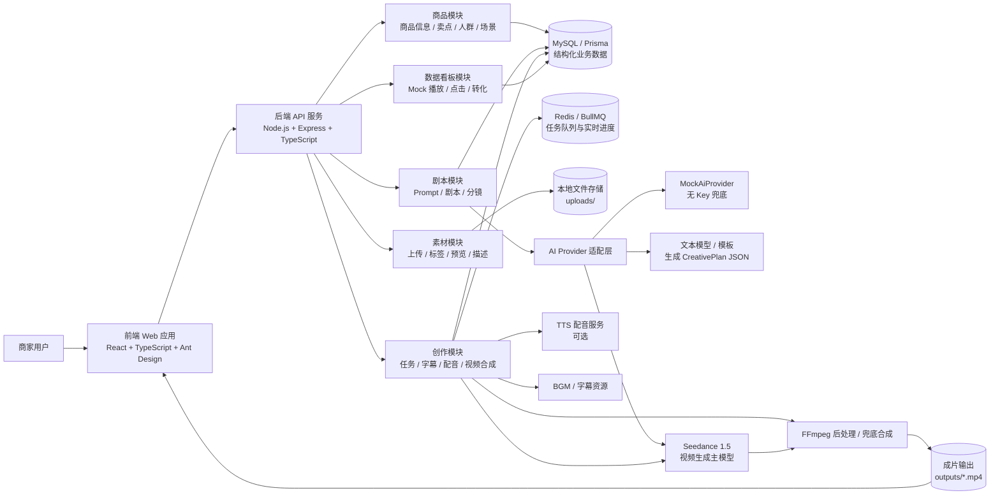
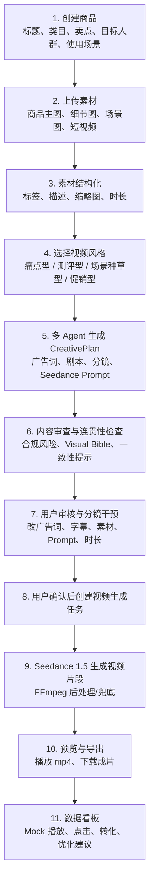
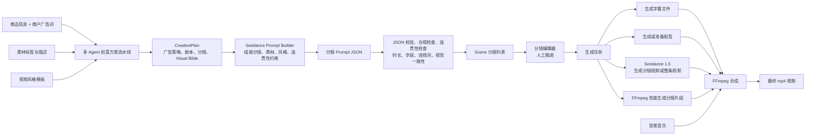
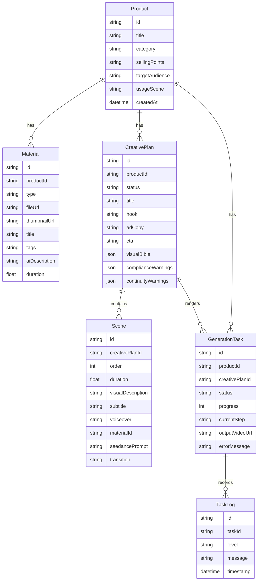
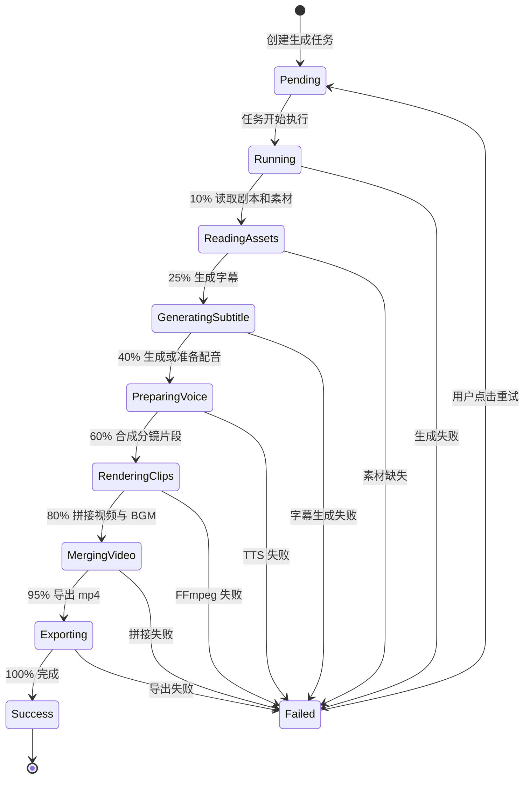

# 电商场景 AIGC 带货视频生成系统架构图

## 1. 总体系统架构

```mermaid
flowchart LR
  Merchant["商家用户"] --> Web["前端 Web 应用<br/>React + TypeScript + Ant Design"]

  Web --> API["后端 API 服务<br/>Node.js + Express + TypeScript"]

  API --> ProductModule["商品模块<br/>商品信息 / 卖点 / 人群 / 场景"]
  API --> MaterialModule["素材模块<br/>上传 / 标签 / 预览 / 描述"]
  API --> ScriptModule["剧本模块<br/>Prompt / 剧本 / 分镜"]
  API --> RenderModule["创作模块<br/>任务 / 字幕 / 配音 / 视频合成"]
  API --> AnalyticsModule["数据看板模块<br/>Mock 播放 / 点击 / 转化"]

  ProductModule --> DB[("MySQL / Prisma<br/>结构化业务数据")]
  RenderModule --> Redis[("Redis / BullMQ<br/>任务队列与实时进度")]
  MaterialModule --> FileStore[("本地文件存储<br/>uploads/")]
  ScriptModule --> DB
  RenderModule --> DB
  AnalyticsModule --> DB

  ScriptModule --> AIProvider["AI Provider 适配层"]
  AIProvider --> MockAI["MockAiProvider<br/>无 Key 兜底"]
  AIProvider --> ScriptAI["文本模型 / 模板<br/>生成 CreativePlan JSON"]
  AIProvider --> Seedance["Seedance 1.5<br/>视频生成主模型"]

  RenderModule --> Seedance
  RenderModule --> FFmpeg["FFmpeg 后处理 / 兜底合成"]
  RenderModule --> TTS["TTS 配音服务<br/>可选"]
  RenderModule --> BGM["BGM / 字幕资源"]

  Seedance --> FFmpeg
  FFmpeg --> Output[("成片输出<br/>outputs/*.mp4")]
  Output --> Web
```

## 2. 核心业务流程

```mermaid
flowchart TD
  A["1. 创建商品<br/>标题、类目、卖点、目标人群、使用场景"] --> B["2. 上传素材<br/>商品主图、细节图、场景图、短视频"]
  B --> C["3. 素材结构化<br/>标签、描述、缩略图、时长"]
  C --> D["4. 选择视频风格<br/>痛点型 / 测评型 / 场景种草型 / 促销型"]
  D --> E["5. 多 Agent 生成 CreativePlan<br/>广告词、剧本、分镜、Seedance Prompt"]
  E --> F["6. 内容审查与连贯性检查<br/>合规风险、Visual Bible、一致性提示"]
  F --> G["7. 用户审核与分镜干预<br/>改广告词、字幕、素材、Prompt、时长"]
  G --> H["8. 用户确认后创建视频生成任务"]
  H --> I["9. Seedance 1.5 生成视频片段<br/>FFmpeg 后处理/兜底"]
  I --> J["10. 预览与导出<br/>播放 mp4、下载成片"]
  J --> K["11. 数据看板<br/>Mock 播放、点击、转化、优化建议"]
```

## 3. AI 与视频生成链路

```mermaid
flowchart LR
  Product["商品信息 + 商户广告词"] --> Agents["多 Agent 创意方案流水线"]
  Materials["素材标签与描述"] --> Agents
  Style["视频风格模板"] --> Agents

  Agents --> CreativePlan["CreativePlan<br/>广告策略、剧本、分镜、Visual Bible"]
  CreativePlan --> Prompt["Seedance Prompt Builder<br/>组装分镜、素材、风格、连贯性约束"]
  Prompt --> ScriptJSON["分镜 Prompt JSON"]

  ScriptJSON --> Validator["JSON 校验、合规检查、连贯性检查<br/>时长、字段、违规词、视觉一致性"]
  Validator --> Scenes["Scene 分镜列表"]

  Scenes --> Editor["分镜编辑器<br/>人工微调"]
  Editor --> RenderTask["生成任务"]

  RenderTask --> SeedanceVideo["Seedance 1.5<br/>生成分镜视频或整条视频"]
  RenderTask --> Subtitle["生成字幕文件"]
  RenderTask --> Voice["生成或准备配音"]
  RenderTask --> FallbackClips["FFmpeg 兜底生成分镜片段"]

  Subtitle --> FFmpeg["FFmpeg 合成"]
  Voice --> FFmpeg
  SeedanceVideo --> FFmpeg
  FallbackClips --> FFmpeg
  BGM["背景音乐"] --> FFmpeg

  FFmpeg --> Video["最终 mp4 视频"]
```

## 4. 数据模型关系

```mermaid
erDiagram
  Product ||--o{ Material : has
  Product ||--o{ CreativePlan : has
  CreativePlan ||--o{ Scene : contains
  Product ||--o{ GenerationTask : has
  CreativePlan ||--o{ GenerationTask : renders
  GenerationTask ||--o{ TaskLog : records

  Product {
    string id
    string title
    string category
    string sellingPoints
    string targetAudience
    string usageScene
    datetime createdAt
  }

  Material {
    string id
    string productId
    string type
    string fileUrl
    string thumbnailUrl
    string title
    string tags
    string aiDescription
    float duration
  }

  CreativePlan {
    string id
    string productId
    string status
    string title
    string hook
    string adCopy
    string cta
    json visualBible
    json complianceWarnings
    json continuityWarnings
  }

  Scene {
    string id
    string creativePlanId
    int order
    float duration
    string visualDescription
    string subtitle
    string voiceover
    string materialId
    string seedancePrompt
    string transition
  }

  GenerationTask {
    string id
    string productId
    string creativePlanId
    string status
    int progress
    string currentStep
    string outputVideoUrl
    string errorMessage
  }

  TaskLog {
    string id
    string taskId
    string level
    string message
    datetime timestamp
  }
```

## 5. 任务状态流转

```mermaid
stateDiagram-v2
  [*] --> Pending: 创建生成任务
  Pending --> Running: 任务开始执行

  Running --> ReadingAssets: 10% 读取剧本和素材
  ReadingAssets --> GeneratingSubtitle: 25% 生成字幕
  GeneratingSubtitle --> PreparingVoice: 40% 生成或准备配音
  PreparingVoice --> RenderingClips: 60% 合成分镜片段
  RenderingClips --> MergingVideo: 80% 拼接视频与 BGM
  MergingVideo --> Exporting: 95% 导出 mp4
  Exporting --> Success: 100% 完成

  Running --> Failed: 生成失败
  ReadingAssets --> Failed: 素材缺失
  GeneratingSubtitle --> Failed: 字幕生成失败
  PreparingVoice --> Failed: TTS 失败
  RenderingClips --> Failed: FFmpeg 失败
  MergingVideo --> Failed: 拼接失败
  Exporting --> Failed: 导出失败

  Failed --> Pending: 用户点击重试
  Success --> [*]
```
